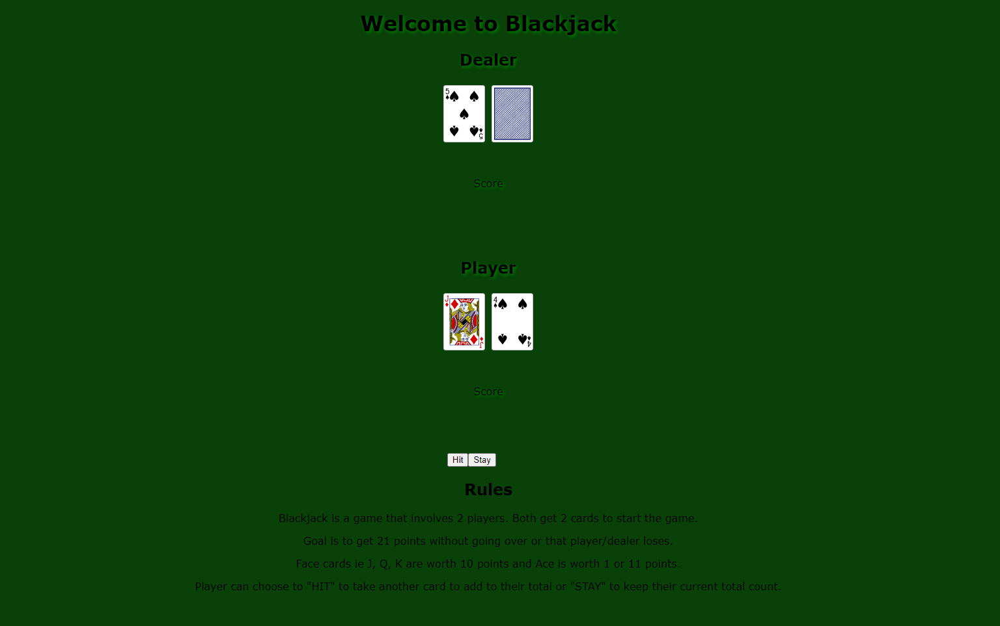
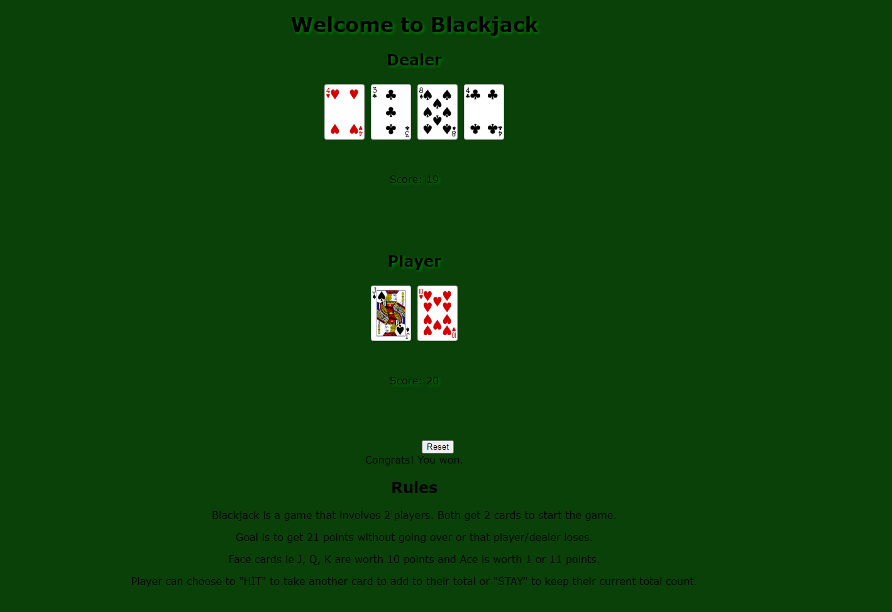
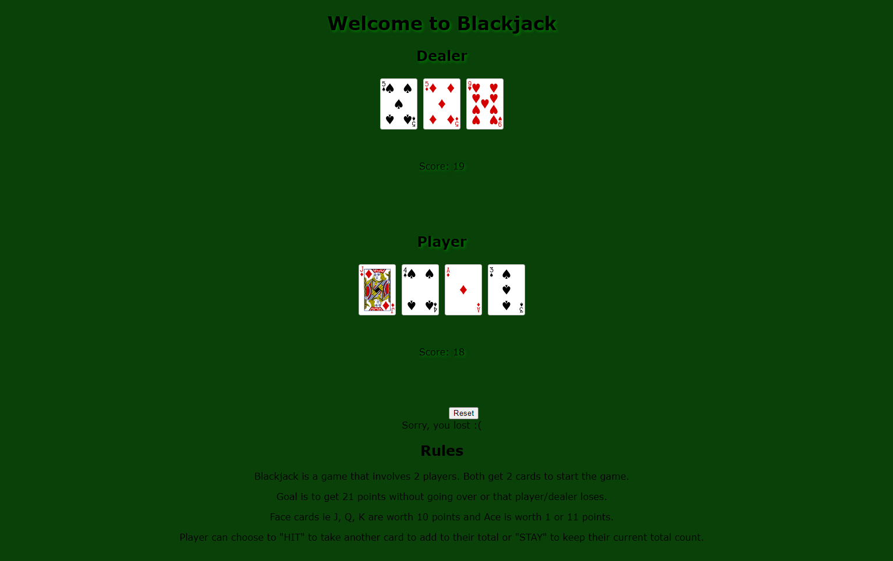

# BlackJack

This is my first project as a student at General Assembly.

### Game Rules:

Dealer deals 2 cards to player/players and also 2 for themselves. The goal of the game is get 21 points without going over 21. Face cards ie J, Q, K are worth 10 points while the Ace is worth either 1 or 11 points. Either player or dealer may "HIT" to get another card to add to their total or "STAY" to keep their current total count. 

* Techonologies Used:

  * HTML
  * CSS
  * Javascript

### Getting Started:

### Images: 

##### Future updates
 
 * Betting System
 * Double Down 
 * Split Card 
